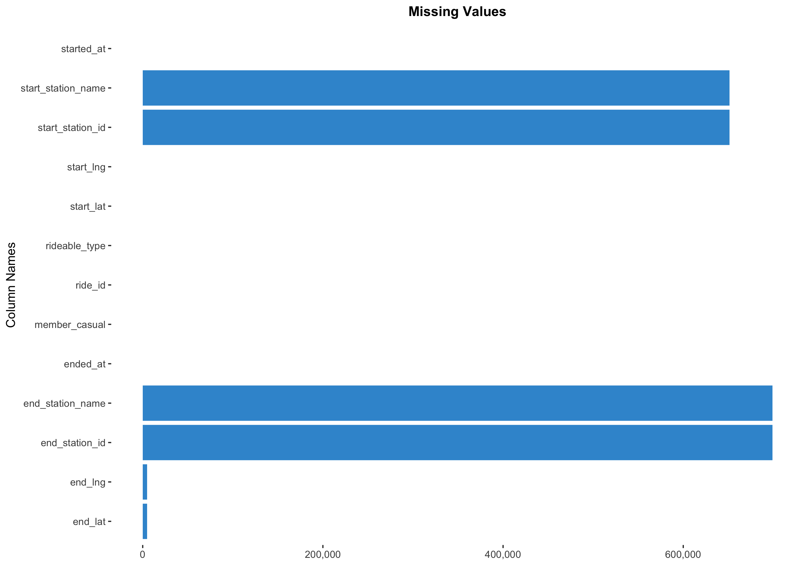
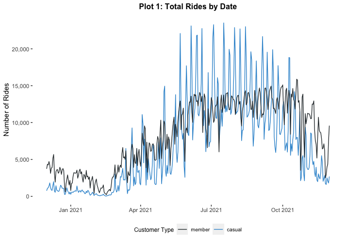

# Google Data Analytics Capstone: Cyclistic Analysis
By Andrés Rojas   
January, 2022

# Introduction

The following case study is the final project in the [Google Data Analytics Professional Certificate](https://www.coursera.org/professional-certificates/google-data-analytics). The goal is to perform real-world tasks of a junior data analyst, and follow all the steps in the data analysis process that were taught throughout the courses. In this case study, I will simulate the role of a junior data analyst working in the marketing analyst team at Cyclistic, a bike-share company in Chicago.

## About the Company

Cyclistic is a bike-share company based in Chicago. It launched in 2016 with a fleet of 5,824 bicycles within a network of 692 stations across the city. The service provided by the company allows its customers to unlock the bikes in one station and return them to other stations in the system.

To ensure that Cyclistic fulfills the different needs of their potential customers, they offer three different pricing plans: single-ride passes, full-day passes, and annual memberships. Customers who purchase the first two plans are referred to as 'casual riders', and customers who purchase the latter are 'Cyclistic members'.

## The Scenario

After quite some time, the finance analysts have concluded that the annual members are much more profitable than casual riders. For this reason, Lily Moreno (director of marketing) believes that the next marketing tactics should focus on maximizing the number of annual members. However, she argues that Cyclistic should not target new customers, but instead convert 'casual riders' into annual members.

#### Business Task

The main task of the junior data analyst is to identify trends in the historical bike trip data of the company and establish the differences between the annual members and the casual riders. The potential findings will guide the future marketing program.

#### Key Stakeholders

* **Lily Moreno**: Director of Marketing and responsible for the developments of campaigns
* **Marketing Analytics Team**: A team of data analysts who are responsible for collecting, analyzing, and reporting data that helps guide Cyclistic marketing strategy.
* **Executive Team**: They are responsible for the approval of the recommended marketing campaigns

## About the Data

The Cyclistic's historical trip data is provided by Motivate Inc. and uploaded every month in an online repository as a public dataset. There is a .csv file for each month since 2015, and each file tracks every single ride during that month. The variables included in this database are:

* ride_id
* rideable_type
* started_at / ended_at
* start_station_name / start_station_id
* end_station_name / end_station_id
* start_lat / start_lng
* end_lat / end_lng
* member_casual

Due to data-privacy issues, there is no information about the customers' credit card numbers (hence, it is not possible to determine the geolocation of the purchase). For the purpose of this case study, only the last 12 months of the historical trip data were used (December 2020 to November 2021). This is a very good aspect of the data because it shows that it is current and still relevant.

The only clear limitation of this dataset is that about 20% of the observations do not have any record about the start or end stations, so these missing values will not allow to identify the corresponding routes of these rides. Furthermore, since there is no more information about how each observation is recorded (automatic or manual data-entry), it is not possible to examine any potential bias. This problem could happen, for example, if each customer has to record manually the names of the station where the ride starts or ends, and for some reason a specific group with the same characteristics does not record this information.

# Data Processing

For this case study, the processing stage is performed in RStudio, which seems to be a proper tool to handle the large files included in the dataset. However, it is important to notice that the same process could be done with other tools like BigQuery (using SQL) or in other statistical packages like Stata.

#### Data Collection and Merging
The fist step is to load the libraries used in the cleaning process. In this case, the ones that are used are **tidyverse, lubridate, dplyr and ggplot2**.

Then, it is necessary to load each data set per month with the `read_csv` function, which will create 12 different data frames in the environment. However, to perform further transformations, it is important to merge all of these into a single large data frame, in order to avoid repeating the same process for each month.

#### Checking of Missing Values
After the creation of this single data frame (called `all_trips`), it is recommended to check for missing values in order to verify if any further analysis is possible.

The results show that the columns with missing values are the ones related to the correspondent stations. However, as it was mentioned earlier, it is not possible to verify the existence of a potential bias.
Nevertheless, the main analysis is based on the other columns with no missing values, which implies that the final conclusions and recommendations of this case study will not be biased.

The results show that the columns with missing values are the ones related to the correspondent stations. However, as it was mentioned earlier, it is not possible to verify the existence of a potential bias.
Nevertheless, the main analysis is based on the other columns with no missing values, which implies that the final conclusions and recommendations of this case study will not be biased.

#### Creation of Variables
The next steps include the creation of new columns necessary for this analysis. The main variable created is `minutes_ride_length`, which represents the difference in minutes between the time of start and end of each ride. The other additions are date variables such as *month*, *year* and *day of the week*.

#### Removing "Bad" Data

The last step in this cleaning process involves dropping observations that do not match the following criteria:

* `minutes_ride_length` has to be a positive value (greater than zero)
* `start_station_name` and `end_station_name` can not be recorded as a blank space, nor they can be any of the repair stations of the company

Both of these conditions ensure that the results are consistent and reliable.

#### Final Outputs

Finally, there are two separate data frames that are obtained after this cleaning process:

1. `start_station_info`: summarizes the top 200 start stations, based on the total number of rides (either by casual customers or members)
2. `all_trips_v3`: Cyclistic's cleaned trip data

# Data Analysis
The first results of the comparison between both types of customers show that the annual members have a lower average ride length than casual customers. 
This difference amounts to 20 minutes approximately, which could be an initial indicator that the purpose of the rides are also different.

In fact, the next couple of visualizations support this last argument. **Plot 1** shows that the number of rides by annual members were almost uniform since April 2021. The upwards trend between December 2020 and March 2021 could have happened because of the colder weather conditions and the health restrictions during the pandemic. On the other hand, **Plot 2** shows a very clear peak of the number of rides by casual members between the months with the highest temperatures in a year, while it is not the case during months like September, October or November.

Even more, despite the fluctuations of the number of rides that could happen due to seasonality, the evidence shows that annual members could have a more specific purpose for their rides. This argument can be inferred from the fact that their average ride length in minutes is almost uniform throughout the year (View **Plot 3**).

However, the same indicator has very different values for the casual customers, which also implies that the purpose of their rides can vary a lot (work, tourism or pleasure).

A different perspective of these results can be obtained if the analysis is based on the days of the week. **Plot 4** shows that the members are more likely to take a ride during weekdays, which does not happen during the weekends.

Moreover, for the members the average ride duration is constant throughout the week, with a very slight increase on Saturday and Sunday (View **Plot 5**). This could mean that they take these rides mainly to commute to their workplaces (or educational centers), but also that even this group is likely to take a ride just for leisure (given the fact that they do not have to pay extra for these situations). On the contrary, the numbers of casual customers are much larger during the weekends, which implies a predominance of bike rides for tourism or leisure.

There are also clear differences on the type of bike each customer tends to choose. For example, **Plot 6** shows that casual customers do not seem to have a preference over classic or electric bikes. However, the rides on electric bikes do last longer (View **Plot 7**). This could happen because the e-bikes use always-on pedal-assist technology, so casual customers could take advantage of this feature since they seem to be more likely to take a ride for tourism or leisure. 

Annual members, on the other hand, seem to have a strong preference for classic bikes (almost 50% more rides than on electric bikes). Nevertheless, the rides average duration is almost the same for both rideable types, which again could be a strong indicator that members are more focus on commuting to their workplaces than on tourism rides.

Finally, some differences can be found on the rides starting stations. The map below shows that casual customers tend to start their rides closer to the coastal area, which could be considered more attractive for tourism. As for the annual members, their starting stations are more diversified around the city.

# Conclusion

The present case study had the objective to analyze the Cyclistic's historical trip data and identify the potential differences between the annual members and casual customers. There are two main conclusions that can be obtained for each profile:

* Casual customers ride more frequently and for a longer period of time during warmer seasons. They are more active during the weekends and have a preference for e-bikes (since these allow to take longer rides more easily). Also, they tend to start from stations closer to the coast. These results suggest that casual customers are more focused on rides for leisure and tourism, but other reasons cannot be ruled out, specially during the weekdays.

* Annual members appear to take rides regularly throughout the year, with an expected slight decrease during colder months. Unlike casual customers, they are much more active during the weekdays, but do not have a preference for either rideable type. Also, the starting stations they choose are more diversified around the city, and not clustered inside a small area. The results suggest that annual members are more focused on commuting to their workplaces, but again other reasons cannot be ruled out, since the rides during the weekends are a bit longer.

Despite not being the main task for this case study, some recommendations can be proposed based on the previous conclusions to convert casual customers to annual members:

1. Identify and create campaigns for the casual customers that took a single ride just to check if Cyclistic's system works well, before committing to an annual membership. Ideally, the company could collect some feedback from their customers indicating the reason of their ride.

2. Analyze if the addition of newer stations within the city could motivate this conversion, since casual customers have a preference for e-bikes, but the latter only work with non-traditional docking stations.
